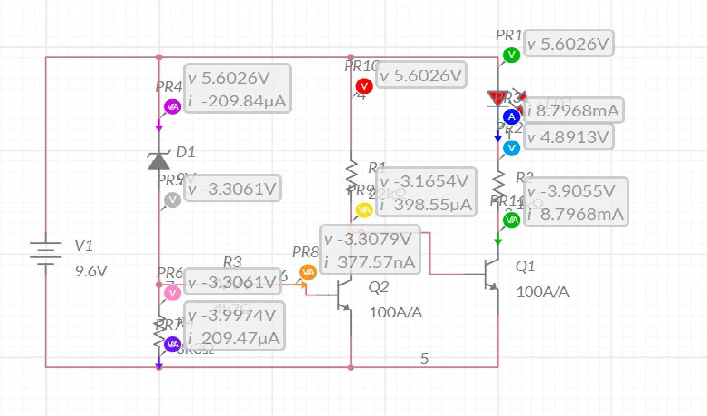

# Low-batttery-indicator-project
 
This project was part of our analog electronics project work .This project was a team project consisting of 4 members . The key roles played included virtual testing and physical testing of the circuit and analyse the working of the circuit.

 

# THEORY:
 
 
ADVANTAGE OVER CONVENTIONAL ICs
 
 
 
The main advantage of the proposed two transistor low battery indicator circuit is its
very low current consumption compared to the IC counterparts which consume
relatively higher currents. A IC 555 would consume around 5mA, a IC741 around 3 mA, while the present
circuit would just consume around 1.5mA current. Thus the present circuit becomes more efficient especially in cases where stand by
current consumption tend to become an issue, example suppose in units which depend
on low current battery supplies such as a 9V PP3 battery. Another advantage of this circuit is it's ability to work even at voltages around 1.5V
which gives it a clear edge over the IC based circuits. the two transistors are configured as voltage sensor and inverter. The first transistor on the left senses the threshold voltage level as per the setting of the
47K preset. As long as this transistor conducts, the second transistor on the right is
held switched OFF, which also keeps the LED switched OFF. As soon as the battery voltage falls below the set threshold level, the left transistor is
no longer able to conduct. This situation instantly triggers the right hand side transistor, switching ON the LED. The LED switches ON and provides the required indications of a low battery warning. WHY NPN TRANSISTORS ARE USED INSTEAD OF PNP
1. NPN transistors have electron as majority carrier and so NPN is preferred
because of faster mobility of electrons. 2. NPN is most suitable for negative ground system. 3. Common Emitter configuration is most widely used transistor configuration. a. with PNP transistor, +ve supply line becomes common point (circuit ground) of
input & output signal, which is not so convenient for design, testing and
maintenance. b. with NPN transistors, -ve supply becomes common point and resulting in -ve
ground, which is convenient for design, testing & maintenance. 4. The mass processing of Si based components are most economically manufactured
using large N type silicon wafers while PNP transistor requires 3 times more Si
chip surface, so it gets uneconomical when the chip costs are a big part of the
component. 
 
 
 
WHAT IS HFE AND BETA
 
 
 
HFE is an abbreviation that stands for HYBRID parameter FORWARD current
gain, common EMITTER, and is a measure of DC gain of a junction transistor. For some transistors HFE readings may be done at several crucial frequencies as well
as DC. BETA is a better term for common-base designs, or just a general statement
about DC and/or AC current gain in a known circuit.

 

# USE OF ZENER AND BJTs IN THE CIRCUIT:
 
A)Zener diode
 
 
The zener diode is used in the circuit to regulate voltage so that the voltage across
the led does not cross a particular voltage.This helps in preventing any damage to the
diode.If the voltage in the diode crosses a particular threshold there are chances that
the diode might get damaged.Hence a zener is used so as to prevent the damage to
the diode. The voltage of the diode also controls the resistances in the circuit.The led can be
used for different ranges of input voltages.This can be done with a few tweaks here
and there of the zener diode and the resistances. This is aptly explained in the diagram attached. 
 
 
 
B) BI-Junction Transistor:
 
The use of a BJT in this circuit is very pivotal in providing the current amplification.The
beta factor of the npn transistor used here(BC547/BC549) varies between 100-800
depending on the diode model A,B or C. This provides an amplification to the current.Otherwise the current through the led
would have been low due to the high resistances in the circuit.Also the resistance
values could not have been lowered otherwise the led might get damaged due to
very high current flowing through the LED.Hence a proper balance is required to be
maintained between the resistances and the zener diode.

 

# Range of operation of the low power/battery indicator:
 
 
 
This discussion basically discusses why the following components were used and
forms the basis of the circuit diagram. Assuming that the circuit operates in the range of (V-,V+) where V- is the lowest
voltage for which the circuit operates and V+ is the highest voltage for which the
circuit is operational. One important point to note here is that circuit has used BJTs as well as zener
diode and not just a circuit with a single zener diode to indicate low power .This is
because when we use a single zener diode we get a lower voltage point as 0v
whereas in case of such a complicated circuit we can actually increase the lower
voltage from 0v to some V- point.This point in case of a simulated circuit with beta
amplification of 100(ideal beta amplification) comes to be around 1.9V. One more thing to note is that this circuit is a low power circuit hence the current
requirements for the diode are very low.The power dissipated as well as required for
the circuit is very low.
 
 
 
For V-=1.9V
You want the LED to turn on at about 1.9V. I am going to make the assumption you
want it to work in the range of 1.9V to 9.6V, so we'll use those two as the extremes of
our calculation. Further, for ease of the example I am going to assume a hfe of the
BC547 of 100. a BC547C type may go up to 500 in the right circumstances.
First off, you mention a low-power LED. This again drives an assumption, as no
specifications are made, I will assume the LED current is 1-10mA( a few mAs) and
that the red LED adheres to commonalities, needing about 1.8V at that current. Here
we go!:
 
 
 
Lowest V+ = 1.9V, I(led) = 0.001A, V(led) = 1.8V, means: R(led) = (1.9V - 0.7) / 0.001A
=1.1 k Ohm. LED current at 9.6V: I(led-9.6) = (9.6V - 1.9V) / 1kOhm =8mA

  

The current into the base of the LED's transistor then becomes 80uA at 9.6V and
10uA at 1.9V (divided by hfe, which is assumed 100). Which means:
Bias Resistor value, maximum: Rbias = (V+ - Vbase) / I(base) = (9.6V - 0.7V) / 80uA = 1271kOhm; or (1.8V - 0.7V)/10uA = 110kOhm (1.8v assuming lowest v for led to
light) , meaning 1000kOhm is our upper limit.However we have used a resistor of
22kohm which is well inside the safe range. The transitor T1 is used just to amplify current to the second transistor.A currrent
with values in nanoAmperes are amplified from T1 to microAmperes and finally to
milliAmperes from T2 in the given circuit. The rest is determined by your choice of Zener and Resistor to determine the initial
trip voltage. The rest of the "waste" will be determined by your zener. Once the
battery is at the trip level, the zener will start to cut off, so its loss will slowly
minimize, but then, of course your LED will be draining 2mA. For a reliable operation you want Iz not to be too far from its optimum, i.e. not a
factor of 100. But there are probably types that can give decent effects with a bias
current of 0.5mA.

 
 

# OBSERVATIONS:

 
 
The volatge range for which the simulation works properly is:
V+(highest voltage)=9.6V
V-(lowest voltage)=1.9V
The actual range of values are approximately equal.
